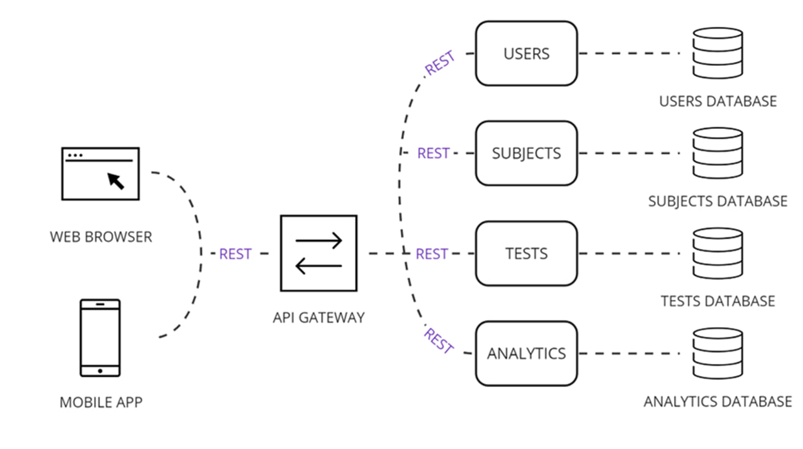

# Quiz-platform for education | Платформа викторин для образования

This repository contains a tool for interactively performing smart cross-testing. Online version available at

## Demo
*in the process of implementation

## Documentation
*in the process of implementation

## Architecture

## Methods
To check their mastery of the material after the lecture, students make their own tests. Then, before the next class, students take tests from other students. As a result, 2 numerical characteristics are obtained:

* 1 numerical characteristic – analyticity.
  
Analyticity – the ability to analyze data and information. This characteristic is calculated using the student's test scores and the average formula, but outliers are excluded if there are any.
Formula robust average:

  𝑅𝑀 = 𝑚𝑒𝑑(𝑋)

Based on this formula, the average will be the median value of the grades for all classes. Using this formula minimizes the impact of outliers on a student's results.

* 2 numerical characteristic – creativity.
  
Creativity is the ability to find non-standard solutions and come up with interesting and moderately complex questions. The student must design the test so that it will challenge other students to varying degrees of difficulty. This characteristic is calculated using the robust coefficient of variation formula.
Formula for robust coefficient of variation:

  𝑅𝐶𝑉 = 𝐼𝑄𝑅/𝑚𝑒𝑑(𝑋), 
  
  где  𝐼𝑄R - this is the interquartile range, 𝑋 - a vector consisting of the proportion of correct answers to each question.

## Installation

## Sources

- [УПРАВЛЕНИЕ ОБРАЗОВАТЕЛЬНЫМ ПРОЦЕССОМ](https://www.sciencedirect.com/science/article/pii/S1877050923020094HTTPS//science-education.ru/ru/article/view?id=13932)
- [Образование в цифровую эпоху](https://arxiv.org/abs/2312.04330](https://magellan.pro/2019/03/04/obrazovanie-v-cifrovuju-jepohu/)https://magellan.pro/2019/03/04/obrazovanie-v-cifrovuju-jepohu/)

