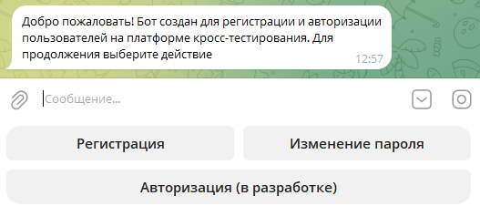
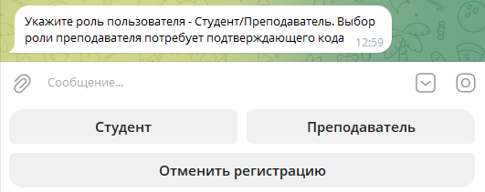

### Краткая документация по созданию пользователя в системе через ТГ бота

1. Переходим по ссылке бота [@crosstesting_helper_bot](https://t.me/crosstesting_helper_bot), нажимаем на кнопку "Cтарт" или вводим /start

2. Выбираем шаг "Регистрация"

3. Выбираем роль пользователя для будущего аккаунта - Студент или Преподаватель. В случае выбора роли преподавателя бот потребует ввода кода подтверждения. Код можно запросить у администратора системы.

4. Придумайте и напишите логин в системе. Логин должен состоять из 3-20 символов латиницы или цифр (без пробелов). В случае если пользователь с таким логином уже существует - повторите шаг и укажите иной.

5. Укажите ваше ФИО для отображения в системе в формате "Фамилия Имя Отчество". Разделитель - пробел.

6. Укажите Email. В случае необходимости его можно будет изменить в системе.

7. Укажите телефон (необязательно). Введите через +7 или 8 (11 цифр), либо нажмите Пропустить для перехода к следующему шагу

8. Придумайте и укажите пароль для авторизации в системе. Пароль должен состоять минимум из 8 символов, содержать только символы латиницы, иметь минимум одну цифру и спецсимвол

Если все шаги выполнены успешно, бот пришлет подтверждающее сообщение о создании нового пользователя и ссылку для авторизации в самой системе.

Для авторизации в системе используйте ранее указанный логин или email и пароль.

В случае возникновения ошибки создания пользователя бот пришлет краткий текст ошибки. Если содержание ошибки непонятно, обратитесь за помошью к администратору системы.
